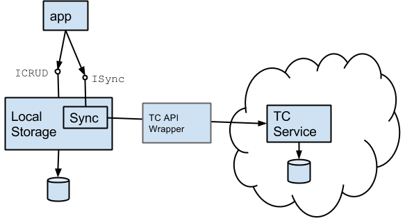
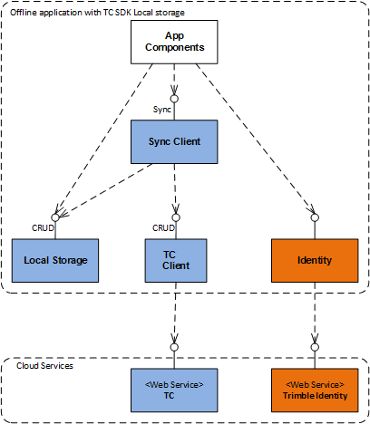

# Trimble Connect .NET SDK Developer Guide

### Content

1. [Introduction](#introduction)
2. [Components](#components)
3. [Building applications with TC SDK Components](#applications)
4. [TC environments](#environments)
5. [Components developer guides](#component_guides)
6. [NuGet packages](#nuget)
7. [Support](#support)

### Acronyms

TID - Trimble Identity

TC - Trimble Connect

pod - TC terminology for a regional deployment of the service

### Terminology mapping

TC .NET SDK uses different terminology comparing to TC v2 REST API in some places.

<table>
  <tr>
    <td>TC REST API</td>
    <td>TC .NET SDK Data Component</td>
  </tr>
  <tr>
    <td>Alignment</td>
    <td>Placement
(Alignment class is used for the "matrix" type of the representation of the model placement)</td>
  </tr> 
</table>

## <a name="introduction">Introduction</a>

Trimble Connect .NET SDK is: 

* a set of components, tools, examples, and guidelines, 

* for desktop, web and mobile .NET application developers (both Trimble and 3rd party) as well as for service applications (e.g. server side background and interactive processes) developers,

* built to enable collaboration functionality in applications using Trimble Connect Services or implement integration of other systems with Trimble Connect.

The Trimble Connect SDK contains all of the necessary tools and building blocks to handle user authentication and to communicate with the Trimble Connect Platform Services in order to share data and collaborate with other users and applications using the TC.

Here are some benefits of using the TC .NET SDK comparing to the plain REST API.
TC .NET SDK provides added value for the desktop and mobile applications over using the plain REST API. 

1. Convenience wrappers for the REST API give the .NET developer a comfortable API paradigm to work with in the .NET world.
2. The REST wrappers API is strongly typed. This boosts the developer productivity by providing compile type error checking.
3. SDK components are built with extensibility in mind and provide set of extensibility mechanisms that help application developers to build backward and forward compatible applications.
4. There are number functional building blocks which are typically required when creation real world applications but might be time consuming to create yourself: message formatting and parsing, error handling, token management and caching, pods connection management.
5. SDK components are cross platform. The same API is available on number of target platforms. This allow to share code between mobile and desktop applications and significantly boost productivity,
6. SDK enables you to build occasionally connected apps that tolerate network performance and availability problems (e.g. on construction site where connection might be not available). Local storage synchronization, merge and conflict resolution mechanisms are build in and available out of the box. 
7. TC SDK uses some private REST APIs that are not available otherwise via public REST API. 
8. SDK components provide full built-in IntelliSense documentation and integration with the development tools. This gives a lot of value since developers can learn the API just by coding and explore the API possibilities right from the IDE.
8. We are using the TC .NET SDK ourself to build core TC applications. This code works and provides value. Developers don't need to spend time designing, implementing and testing similar low level code to access TC data again.

The TC .NET SDK targets full .NET desktop application (.NET 4.0 and above) as well as iOS (7.1+), Android (4.0+) and UWP applications built with Xamarin.

<!-- (Comment) Introductory presentation can be found also [TODO: insert link]().-->

API training videos are available on [youtube](http://www.youtube.com/playlist?list=PLUO6j5jr1rwtrkegAj-YNXq56Si337vPo).

## <a name="components">Components</a>

TC .NET SDK is provided as a set of components.

TC SDK components are implemented as following nuget packages:

1. Trimble.Identity - TID authentication

2. Trimble.Connect.Client - TC API Client (REST API wrappers)

3. Trimble.Connect.Data - TC Data Storage (local offline storage)

4. Trimble.Connect.Data.Sync - synchronization component which uses SQLite for local storage of TC data

All nuget packages target full .NET as well as PCL, iOS, and Android Xamarin platforms.

The nuget packages are available from the [nuget.org](https://www.nuget.org/) and the corresponding symbols from symbolsource.org.  

## <a name="applications">Building Applications with TC SDK Components</a>

### Application design guidelines

This section shows typical application designs using the TC SDK components.

The design of offline components is based on the idea that applications (which want to work in occasionally connected mode) always use same interface to manage data regardless whether a network connection is currently available or not.

The local offline storage component exposes an _ISync_ interface which allows occasional (application driven) synchronization of local data with a the TC cloud backend.

Below are three typical app architecture examples:

1. Use SDK components for local storage and synchronizing with TC cloud backend.

2. Build an app with its own local storage. Using TC cloud backend and the custom local storage.

3. Application without local state (online only app). Using TC cloud backend without local storage.

### Configuring Visual Studio

Since the TC data model uses the _ToDo_ term for one of the entity types this could conflict with “TODO:” comments that are typically used by developers and recognized by the IDE as a keyword. To avoid conflicts, the following settings are recommended in Visual Studio when using TC .NET SDK:

1. Configure ReSharper (if you are using it) to honor the case-sensitivity when searching for "TODO"

2. Add "todo" and "todos" as RecognizedWords to StyleCop settings (again, if you are using StyleCop).

## <a name="environments">TC Environments</a>

TC has several deployment environments that we encourage you to use for debugging, testing, and production.

1. Staging - this environment is recommended for integrators to use during development of connected applications:

    * Staging TC v2 API: [https://app.stage.connect.trimble.com/tc/api/2.0/](https://app.stage.connect.trimble.com/tc/api/2.0/) 

    * Staging TCW: [https://app.stage.connect.trimble.com/tc/app/](https://app.stage.connect.trimble.com/tc/app/) 

2. Production - production Trimble Connect environment

    * Production TC v2 API: [https://app.connect.com/tc/api/2.0/](https://app.connect.trimble.com/tc/api/2.0/) 

    * Production TCW: [http://connect.trimble.com/](http://connect.trimble.com/) 

The staging environment of TC uses staging environment of TID.  Production TC environment uses the production TID environment.

TID environments

* Staging TID: [https://identity-stg.trimble.com/i/oauth2/](https://identity-stg.trimble.com/i/oauth2/) 

* Production TID: [https://identity.trimble.com/i/oauth2/](https://identity.trimble.com/i/oauth2/) 

## <a name="component_guides">Components Developer Guides</a>

This section houses a collection of links to individual components developer guides.

### Trimble.Identity

See [Developer Guide - Identity](Developer%20Guide%20-%20Identity.md).

### Trimble.Connect.Client

See [Developer Guide - Client](Developer%20Guide%20-%20Client.md).

### Trimble.Connect.Data and Trimble.Connect.Data.Sync

See [Developer Guide - Data](Developer%20Guide%20-%20Data.md).

## <a name="nuget">NuGet packages</a>

You can find the official releases on the public stable channel: [https://www.nuget.org/profiles/TrimbleConnect](https://www.nuget.org/profiles/TrimbleConnect).
The beta channel is also available for restricted audience: [http://ts-nuget.teklaad.tekla.com/nuget/tempfortcd/](http://ts-nuget.teklaad.tekla.com/nuget/tempfortcd/)

All published packages support the following platforms:

* .NET 4.0+
* Android 4.0+ (using Xamarin Platform)
* iOS 7.1+ (using Xamarin Platform)

The corresponding symbol packages for stable channel can be found at [http://srv.symbolsource.org/pdb/Public](http://srv.symbolsource.org/pdb/Public).
For the beta channel symbol packages are available as well from this source: [http://ts-nuget.teklaad.tekla.com/symbols/tempfortcd](http://ts-nuget.teklaad.tekla.com/symbols/tempfortcd).

SymbolSource has good instructions on how package consumers can [configure Visual Studio to use the symbol packages ](http://www.symbolsource.org/Public/Home/VisualStudio).

<!--## <a name="samples">Sample apps</a>

Example apps can be found here [TODO: insert link]().-->

## <a name="support">Support</a>

Send email to [connect-integrate@trimble.com](mailto:connect-integrate@trimble.com)

